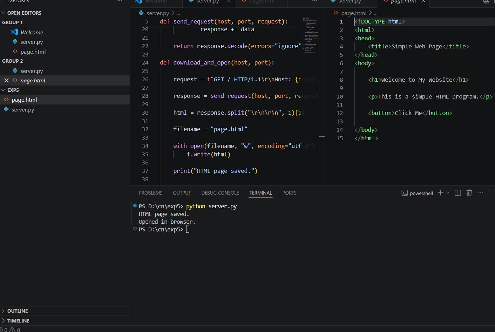

# 5a_Create_Socket_for_HTTP_for_webpage_upload_and_download
## AIM :
To write a PYTHON program for socket for HTTP for web page upload and download
## Algorithm

1.Start the program.
 
2.Get the frame size from the user
 
3.To create the frame based on the user request.
 
4.To send frames to server from the client side.
 
5.If your frames reach the server it will send ACK signal to client otherwise it will send NACK signal to client.
 
6.Stop the program
 
## Program 

SERVER:

import socket

import webbrowser

import os

def send_request(host, port, request):

    with socket.create_connection((host, port)) as s:

        s.sendall(request.encode())

        response = b""

        while True:

            data = s.recv(4096)

            if not data:
                break

            response += data

    return response.decode(errors="ignore")

def download_and_open(host, port):

    request = f"GET / HTTP/1.1\r\nHost: {host}\r\nConnection: close\r\n\r\n"

    response = send_request(host, port, request)

    html = response.split("\r\n\r\n", 1)[1]

    filename = "page.html"

    with open(filename, "w", encoding="utf-8") as f:
        f.write(html)

    print("HTML page saved.")

    path = os.path.abspath(filename)

    webbrowser.open("file://" + path)

    print("Opened in browser.")

if __name__ == "__main__":

    host = "example.com"

    port = 80

    download_and_open(host, port)

PAGE.HTML:

<!DOCTYPE html>

<html>

<head>

    <title>Simple Web Page</title>

</head>

<body>

    <h1>Welcome to My Website</h1>

    
This is a simple HTML program.

    <button>Click Me</button>

</body>

</html>

## OUTPUT

## Result
Thus the socket for HTTP for web page upload and download created and Executed
